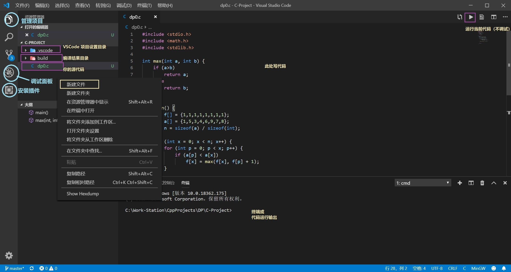
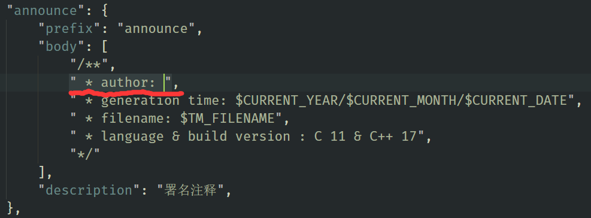

# VSCode-C-Environment

针对 Android 实验室成员 C 或 C++ 语言练习的 VSCode C(C++) 语言环境一键配置。仅适用于 Windows 系统。

2019/9/12：新增两个目录，`C-Project` 适用于 C 语言练习，`C++-Project` 适用于 C++ 练习。

请及时将你本地的环境升级到本代码库的最新版本。（重复下述步骤的第 7~9 步即可）

**更新环境时请*不要*覆盖`c.code-snippets`文件！覆盖除此文件以外的其他所有文件即可更新环境**

## 使用方法

1. 下载 msys64 环境[【从百度云】](https://pan.baidu.com/s/1C0gi_RsI6OD9jGel8Tz7Vg)[【从Office365】](https://cutesakura-my.sharepoint.com/:u:/g/personal/kenvix_cutesakura_net/Ec20TtbKog9HkAPF9E4tZhsBwGX9fBhQghBqlfYuyTDbhA?e=EXl0l0) [【从Github】](https://github.com/android-nuc/VSCode-C-Environment/releases/download/1.0/Msys64-RT.zip) [【内网高速下载 (必须在实验室)】](https://lab.kenvix.com:7401/Msys64-RT.zip)
2. 直接整个压缩包解压到 **C盘** （可能需要管理员权限）
3. 将 `C:\RT\msys64\mingw64\bin` 添加到系统 `PATH` 环境变量（[不知道如何修改环境变量请点击此处](https://jingyan.baidu.com/article/358570f69e8a13ce4724fcf8.html)）
4. 安装 Visual Studio Code[【下载地址】](https://code.visualstudio.com/docs/?dv=win64user)
5. 打开 Visual Studio Code，按下 Ctrl+Shift+X
6. 依次搜索、安装如下扩展：`C/C++` `Code Runner`
7. 下载这个项目（点击右上方绿色的 **Clone or Download**，然后点击 **Download Zip**）
8. 解压这个项目（**千万不要解压到有中文或空格的路径！** 最好直接解压到 `C:\RT\`），进入 VSCode-C-Environment-master 文件夹
9. (C语言)右击 `C-Project` 这个文件夹（C++为`C++-Project`），选择 `Open with Code` 可以看到下面的目录（此时打开的vscode底栏是蓝色的，若是紫色则操作有误）。如果右键没有 `Open with Code` 按钮，则请在 VSCode 中点击 左上角的 *文件* - *打开文件夹*，然后选择对应的目录

* 如果你打开项目后虽然底栏是蓝色但是没法编译 C 语言且要求你进行编译配置，说明**目录开错了**（重读第8、9步，好多人**错误地**开成了 `VSCode-C-Environment-master`）。
* 如果你可以开始编译但提示找不到 gcc，说明环境变量配置错了（重读第 3 步，然后重启vscode）。
* 如果你写代码可以开始编译，编译到一半的时候出现各种奇怪的找不到文件，你是不是错误地把本项目解压到了**有中文的路径**？重读第8步。
* 如果你写代码完全没有任何代码高亮，也不能编译，说明你新建文件的时候文件名写错了。C语言文件名要以 `.c` 结尾。

**备注**：VScode 默认没有中文，搜索 `Chinese (Simplified) Language Pack` 扩展即可安装中文语言。此外，如果你觉得 VSCode 的字太小，可以按 `Ctrl+加号` 放大，反之，按 `Ctrl+减号` 缩小

## C-Project

适用于 C 语言的项目目录。将你的C语言代码放到这里。每个文件是互相独立的，可以独立编译、运行、调试。

提供一个 Hello world 样例文件 `test.c`，可用于测试环境配置是否成功。

点击左侧面板的项目 📑 按钮管理项目文件。新建文件请以 .c 结尾来创建 C 语言文件。

当你写代码时，在左侧面板的调试 🐞 按钮，点击 `▷ (gdb) Launch C` 即可开始调试项目（你现在在写哪个文件就是调试哪个）。

如果你只想运行而不需要调试，点击右上角的 `▷` 可以直接运行而不调试。相比与调试来说，代码输出会直接显示到 VSCode，在程序运行后不会消失，更方便一些。

**友情提示**: 请改掉在你的程序里写 `system("pause")` 的**坏习惯**

### C-Project/build

项目生成在这个目录。如果没有这个目录，必须先手动创建才能编译。

## C++-Project

适用于 C++ 语言的项目目录。将你的C++语言代码放到这里。每个文件是互相独立的，可以独立编译、运行、调试。

提供一个 Hello world 样例文件 `test.cpp`，可用于测试环境配置是否成功。

新建文件请以 .cpp 结尾来创建 C++ 语言文件。

C++-Projects 具有两个编译(调试)选项。 (GCC) Launch C++ 为使用 GCC C++ 编译器编译，(GCC) Launch C 为使用 GCC C 编译器编译。

Launch 之前的括号表示编译器。普通用户请使用 GCC。若想要切换到 MSVC 编译器或 Clang 编译器，需要修改一下编译器路径。其他同上。

> 不难发现，C-Project 就是删除了 C++ 编译支持的 C++-Project

### 注：关于代码提示

- 首先请在`C-Project/.vscode/c.code-snippets`中的`announce`(文件声明)字段添加作者名字(如下图在author: 后面写上作者名(无需真实姓名)) 

- 这里的代码Snippets均重写过，采用的是`K&R`风格，默认为`微软风格`，但是会根据用户之前的选择进行代码提示，所以如果第一次选择`K&R`风格后面便会一直使用`K&R`风格

（对于C++用户，是 `C++-Project`）

### 注：关于中文

你可以在代码输出中文字符串（`printf("%s", "中文");`），但不能用中文文件名，也不能起中文变量名。

这是 GCC 的 Bug。如果你确实有这种需要，方法是换用其他编译器，比如 Clang（操作比较复杂）

> 编译器已被设置为输出 GBK 编码

### 对于高级用户

【以下内容是给高级用户看的，一般用户无需阅读】

#### 切换编译器

